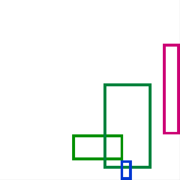
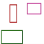
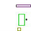
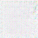
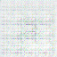
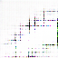
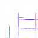
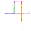
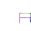

# Draw rectangles by imitating rectangles images 
(and not by supplying it description of how does a rectangle looks like)

It is actually my implementation of DCGAN (tensorflow based) trained on a synthetic database as large as you want

First run "create_bench_folders.py" (change bench_name to any name you want)
Then run "main.py" with similar bench_name

See in Samples folder the evolving of the rectangles structure

Ignore the inverse G network. (its a non finished trial)

Samples from synthetic DB that was used to train:

Generative images (of colored rectangles on white background):

Begining of training:

  

    
  

  

  
  

  

  
Progress training:

  

  

  

      

  

      

  

      

    

